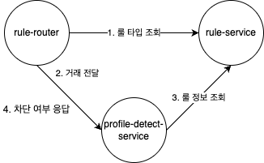
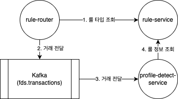

# 🛡 FDS-System Modules Overview

본 프로젝트는 Kafka 기반의 이상 거래 탐지 시스템(Fraud Detection System)을 목표로 구성된 토이 프로젝트입니다.  
각 모듈은 도메인 책임을 기준으로 분리되어 있으며, 이벤트 기반 아키텍처를 통해 느슨한 결합을 유지합니다.

---

## 📦 1. simulator

- **역할**: 외부 시스템을 모사하여 로그 이벤트를 HTTP API로 전송
- **실행 위치**: Docker network 바깥
- **기능**
    - 테스트용 고객 로그 (거래, 로그인 등) 생성
    - `ingestor` 모듈로 HTTP POST 요청 발송

---

## 📦 2. rule-router

- **역할**: 외부 요청을 수신하고, 거래 처리 흐름을 제어
- **실행 위치**: Docker network 내부
- **기능**
  - REST API로 로그 수신 (POST /logs)
  - rule-service에 blocking 여부 질의
  - non-blocking: Kafka topic(`fds.transactions`)에 메시지 publish
  - blocking: profile-service 및 detect-service 연계 호출 후 결과 응답 반환

---

## 📦 3. profile-detect-service

- **역할**: 고객 프로파일 상태 갱신과 이상 거래 탐지를 통합 수행
- **실행 위치**: Docker network 내부
- **기능**
  - fds.transactions 토픽 구독 
  - 고객별 최근 행동 로그/통계 집계 및 상태 정형화 (ProfileSnapshot)
  - 프로파일 갱신 후 룰 평가 수행 및 이상 탐지 시 Detect 생성 및 저장 
  - blocking 흐름에서는 Ingestor에 탐지 결과 응답 반환

---

## 📦 4. rule-service

- **역할**: 룰 정의 및 평가 로직 담당
- **실행 위치**: Docker network 내부
- **기능**
  - 거래의 blocking 여부 판단
  - SubRule 구성 및 평가
  - 탐지 서비스가 평가 요청 시 `evaluate(profile, transaction)` 수행

---

## 🔗 Kafka Topic 구조

| Topic 이름               | 설명                 |
|------------------------|--------------------|
| `fds.transactions`     | 거래/로그인 등 고객 로그 이벤트 |
---

## 🧭 시스템 흐름 요약

### 룰 타입이 차단인 경우

### 룰 타입이 차단이 아닌 경우

---

## ⚖ Blocking / Non-Blocking 처리
- rule-router는 거래 수신 후 rule-service에 blocking 여부 질의
- 룰에 따라 `고위험 거래는 blocking`, `일반 거래는 non-blocking`으로 분기
- Blocking: profile-detect-service 호출 후 응답 반환
- Non-Blocking: Kafka(`fds.transactions`) 발행 후 비동기 처리
- 탐지 정확도와 처리 효율성 균형을 위한 구조